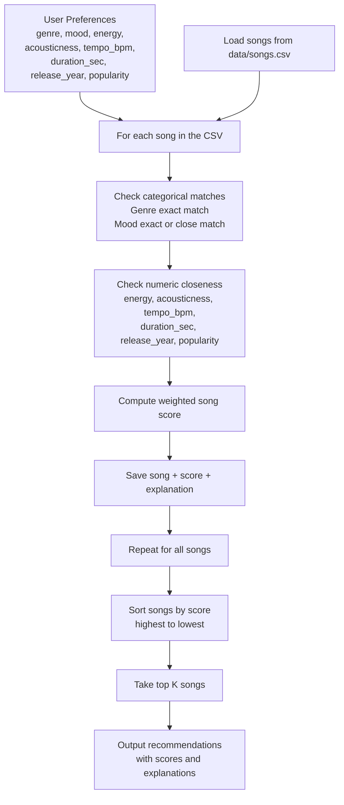
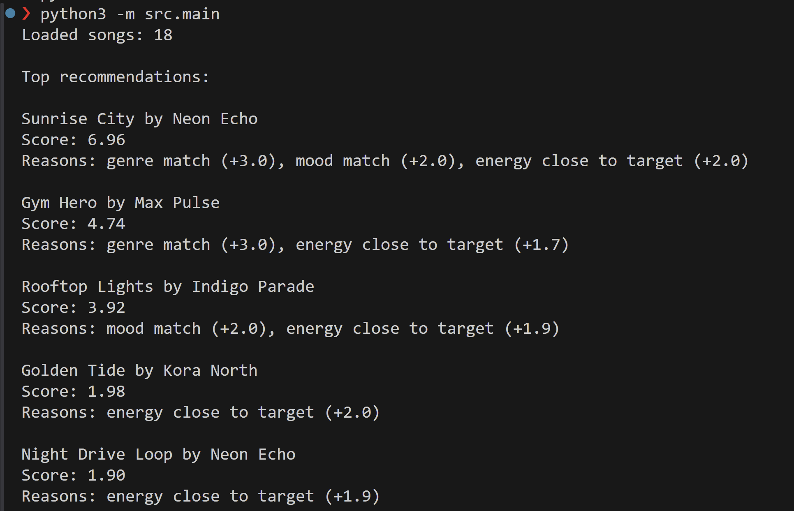

# 🎵 Music Recommender Simulation

## Project Summary

In this project you will build and explain a small music recommender system.

Your goal is to:

- Represent songs and a user "taste profile" as data
- Design a scoring rule that turns that data into recommendations
- Evaluate what your system gets right and wrong
- Reflect on how this mirrors real world AI recommenders

This project builds a small music recommender that scores songs from a hand made catalog based on a user's taste profile. The system uses content based filtering with features like genre, mood, energy, tempo, acousticness, duration, release year, and popularity to rank songs and explain why they were recommended. I also tested it with several normal and edge case listener profiles to see where the scoring logic works well and where it starts to break down.

---

## How The System Works

Explain your design in plain language.

Some prompts to answer:

- What features does each `Song` use in your system
  - For example: genre, mood, energy, tempo
- What information does your `UserProfile` store
- How does your `Recommender` compute a score for each song
- How do you choose which songs to recommend

You can include a simple diagram or bullet list if helpful.

According to my research, real life recommendation systems have several different layers. Spotify docs say its home recommendations use two stages: candidate generation and ranking. It first gets a list of plausible entities to recommend, then ranks those to serve the algorithm. The difference between collaborative filtering and content based filtering is how the algorithms learn and recommend. Collaboritive filtering checks to see what similar users to you are consuming and will recommend the same content to you. Content based filtering only considers the content itself, metadata about songs like genre, artist, or energy. 

My version of the algorithm will prioritize content based filtering, since I won't have enough individual user data to implement collaborative filtering. 

For the first iteration of the algorithm, I think focusing on the important features like genre, mood, energy, and acousticness will net the most results. The UserProfile will contain a lot of the same information it already does, like taste information (favorite genre, favorite mood, target energy, and acousticness). 

My recommender will compute a score for each song by computing a weighted combination of the chosen features. For example, genre will be weighted the heaviest since it usually reflects a strong and stable preference. Songs will be awarded score for matching genre, mood, and being close to numerical features like energy or tempo. 



Each song is represented with both category features and numeric features. The category features are `genre` and `mood`. The numeric features are `energy`, `tempo_bpm`, `valence`, `danceability`, `acousticness`, `duration_sec`, `release_year`, and `popularity`.




---

## Getting Started

### Setup

1. Create a virtual environment (optional but recommended):

   ```bash
   python -m venv .venv
   source .venv/bin/activate      # Mac or Linux
   .venv\Scripts\activate         # Windows

2. Install dependencies

```bash
pip install -r requirements.txt
```

3. Run the app:

```bash
python -m src.main
```

### Running Tests

Run the starter tests with:

```bash
pytest
```

You can add more tests in `tests/test_recommender.py`.

---

## Experiments You Tried

Use this section to document the experiments you ran. For example:

- What happened when you changed the weight on genre from 2.0 to 0.5
The algorithm gave less intentional results, though many were still similar. It had to guess a little more using the other features, if nothing else, it provided some decent variety in the recommendations while still being constrained to the user preferences. 

- What happened when you added tempo or valence to the score
Since tempo doesn't have a large weight, the recommendations still remained stable, with some swaps in the recommendation per user. It seems as though tempo is a background feature usful for refining rather than dominating the algorithm like genre does. 

- How did your system behave for different types of users
The system correctly recommended each of the distinct users I came up with. The High-Energy Pop user was given pop tracks, the Chill Lofi user was served slower, softer songs, and the Deep Intense Rock user was naturally given Storm Runner, the only rock song. 

---

## Limitations and Risks

Summarize some limitations of your recommender.

Examples:

- It only works on a tiny catalog
- It does not understand lyrics or language
- It might over favor one genre or mood

You will go deeper on this in your model card.

The biggest issue with the recommender is it's size and complexity. There's only so many features that it can pick from, and only so many songs it's able to recommend. The hard coded weights also make the recommender one dimensional. There's no learning aspect that can make the algorithm dynamic and personable. There's also currently not a great way to deal with contradictory profiles, it'll just average out the preferences without thinking any deeper about it. 

---

## Reflection

Read and complete `model_card.md`:

[**Model Card**](model_card.md)

Write 1 to 2 paragraphs here about what you learned:

- about how recommenders turn data into predictions
- about where bias or unfairness could show up in systems like this

This project helped me understand how recommenders turn data into predictions by reducing both songs and users into features that can be compared. Once the features are chosen, the recommender can score songs by looking for exact matches like genre or mood and then refining the result with numeric values like energy or tempo. Building it myself made the process feel much less magical. A recommendation is really the result of design choices about what data matters, how much each feature should count, and what kinds of matches the system should reward.

It also made it easier to see where bias and unfairness can show up. My recommender only works on a tiny hand made dataset, so it is automatically biased toward the songs, genres, and moods I decided to include. Users with tastes outside that small catalog are going to get worse results. The scoring system can also favor some users more than others, especially when their taste fits neatly into the features I chose. If this were a real product, the quality and fairness of the recommendations would depend a lot on the size of the dataset, the kinds of users represented in it, and whether the model can handle more complex or contradictory taste patterns.


---
