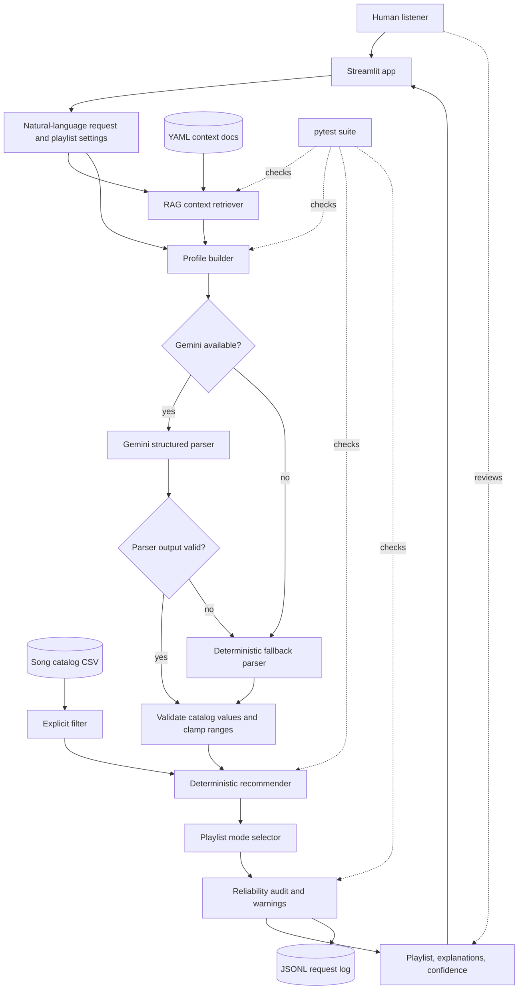
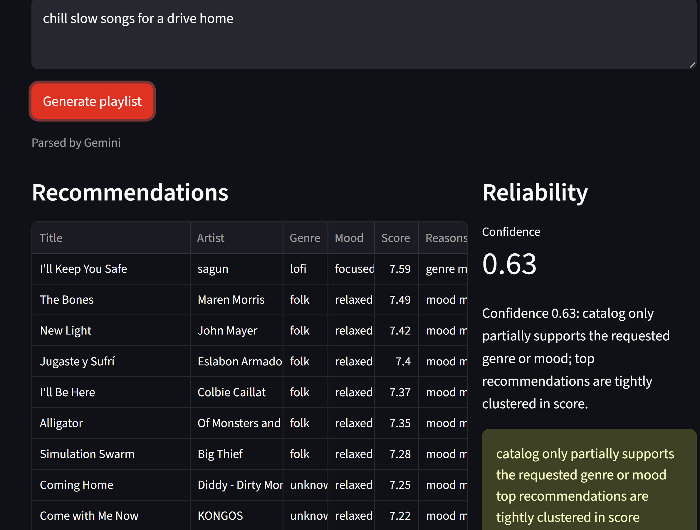
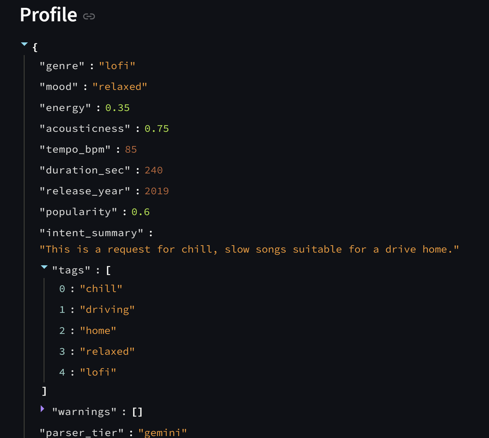
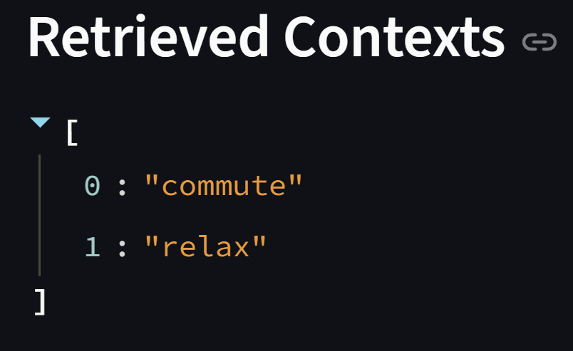
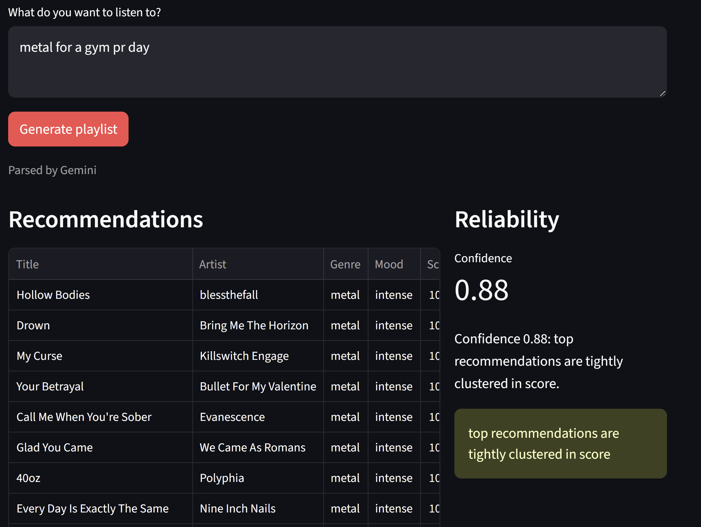
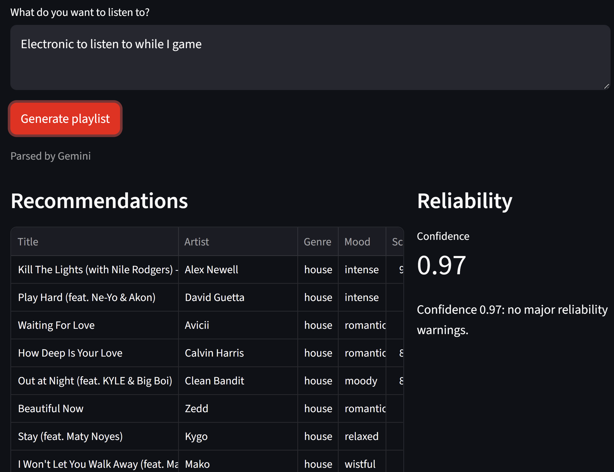

# AI Playlist Copilot

## Original Project: Music Recommender Simulation

My original Modules 1-3 project was a small CSV-backed Music Recommender Simulation. Songs are represented as structured rows in `data/songs.csv`, and the recommender ranks them with transparent weighted scoring over genre, mood, energy, acousticness, tempo, duration, release year, and popularity.

The original goal was to make song recommendations explainable instead of hiding the ranking behind a black box. It could load a local song catalog, score each song against a user profile, return ranked recommendations, and explain the strongest matching features.

The original public API remains compatible:

- `Song`
- `UserProfile`
- `Recommender`
- `load_songs`
- `score_song`
- `recommend_songs`

## Title and Summary

AI Playlist Copilot extends the original recommender into a natural-language playlist tool. It turns a listening request into a playlist by retrieving intent context, building a validated music profile, ranking songs with the original deterministic recommender, auditing reliability, and optionally displaying the result in Streamlit.

This matters because music requests are often vague, emotional, or situational, and the system shows how AI can translate that messy language into transparent, testable recommendation logic.

## Architecture Overview

The original recommender is still the ranking engine. New modules shape the input profile, retrieve context, inspect the output, and make reliability visible:



Context retrieval is deterministic. The YAML files in `data/context_docs/` describe intents such as `study`, `workout`, `sleep`, and `commute`, each with weighted keywords and target ranges for energy, tempo, and acousticness.

Profile generation has two tiers:

- Gemini tier: if `GEMINI_API_KEY` is set, the app asks Gemini to produce a structured profile. The output is still validated against the local catalog and numeric ranges.
- Fallback tier: if Gemini is unavailable, times out, or returns unsupported values, a closed-vocabulary parser uses catalog genres, catalog moods, retrieved contexts, and simple contradiction checks.

Playlist generation supports three modes:

- `close_match`: straight deterministic ranking.
- `variety`: keeps high-scoring songs but favors different artist/genre pairs among near ties.
- `arc`: creates warmup, middle, and peak stage profiles and prevents duplicate songs across stages.

## Loom Walkthrough Video
https://www.loom.com/share/d9325c6a6b434b64817a2eac28edffc6

## Setup Instructions

Create and activate a virtual environment if desired:

```bash
python3 -m venv .venv
source .venv/bin/activate
```

Install dependencies:

```bash
pip install -r requirements.txt
```

Run the original command-line recommender:

```bash
python3 -m src.main
```

Run the Streamlit Copilot:

```bash
python3 -m streamlit run src/app.py --server.headless true --server.port 8501
```

or 

```bash
streamlit run src/app.py
```

Optional Gemini mode:

```bash
export GEMINI_API_KEY="your-key"
streamlit run src/app.py
```

By default, Gemini mode uses `gemini-2.5-flash-lite`. If your Google AI Studio rate-limit page shows zero quota for that model, set `GEMINI_MODEL` to a text-out model with nonzero quota in your project:

```bash
export GEMINI_MODEL="gemini-2.5-flash"
streamlit run src/app.py
```

Without `GEMINI_API_KEY`, or if the Gemini request fails, the app uses the deterministic fallback parser.

### Optional: Importing A Real Catalog

The app defaults to the committed demo catalog at `data/songs.csv`. To build a larger local catalog from a public Spotify playlist, set Spotify client-credentials env vars and run the importer:

```bash
export SPOTIFY_CLIENT_ID="your-client-id"
export SPOTIFY_CLIENT_SECRET="your-client-secret"

python3 -m src.catalog_import \
  --spotify-playlist-id PLAYLIST_ID \
  --output data/generated/songs.spotify.csv
```

Generated catalogs live under `data/generated/`, which is ignored by git. Spotify provides catalog metadata only: title, artist, album, duration, release year, popularity, explicit flag, Spotify IDs/URLs, ISRC, and artist-level genre labels. The importer stores raw Spotify artist genre labels in `artist_genres` and maps them into a broader recommender `genre` when possible. Other recommender-specific traits start with neutral defaults: `mood=unknown`, `energy=0.5`, `tempo_bpm=120`, `valence=0.5`, `danceability=0.5`, and `acousticness=0.5`.

After import, manually enrich `data/generated/songs.spotify.csv` with Codex or by hand. A reusable local prompt is available at `data/generated/codex_enrich_prompt.md`. Review `genre`, fill `mood`, `energy`, `tempo_bpm`, `valence`, `danceability`, and `acousticness`, then set `metadata_source` to `spotify+codex`. Use the existing `data/songs.csv` vocabulary as a consistency guide for genre and mood, and keep numeric values in the same ranges used by the demo catalog.

Launch Streamlit with the generated catalog:

```bash
SONG_PATH=data/generated/songs.spotify.csv python3 -m streamlit run src/app.py --server.headless true --server.port 8501
```

## Sample Interactions

Gemini can help with more indirect requests:

- `drive home after a long day`
- `music my dad would've played at a 1985 cookout`
- `start calm and build into a workout playlist`

The fallback parser handles direct catalog and intent requests:

- `upbeat workout music`
- `quiet study music`
- `calm sleep music`
- `lofi workout`

### Examples

Example 1




Example 2


Example 3



## Design Decisions

I kept the original deterministic recommender as the ranking engine so the final scores stay explainable and testable. The AI layer interprets the user request, but it does not directly choose songs or silently change the scoring rules.

The Gemini tier is optional and validated. If `GEMINI_API_KEY` is set, the app asks Gemini to produce a structured profile, but the output still has to use catalog-supported genres and moods and stay inside numeric ranges. If Gemini is unavailable, times out, or returns unsupported values, the deterministic fallback parser takes over.

The Streamlit app appends one JSONL record per request to `logs/playlist_requests.jsonl`. Logged fields include timestamp, request text, parser tier, fallback reason, retrieved context IDs, profile, recommendation IDs, confidence, and warnings.

The default catalog is tiny, hand-authored, and not representative of real listening taste. Imported Spotify catalogs can add real songs, but their recommender feature values still depend on manual or Codex-assisted enrichment. Users whose preferences are outside the CSV will get weaker recommendations. The system does not understand lyrics, culture, artist identity, user history, or long-term taste.

## Testing Summary

Run all tests:

```bash
python3 -m pytest tests/
```

The suite covers:

- original recommender compatibility
- CSV `explicit` parsing and backward compatibility
- RAG retrieval
- fallback profile generation
- Gemini validation fallback through a mocked client
- close match, variety, and arc playlist modes
- audit warnings and confidence behavior
- Spotify playlist import with mocked HTTP calls

In terms of what worked and what didn't during implementation, I initially tried to integrate both the spotify and deezer apis to retrieve rich track metadata, but then I realized that neither apis really contained the specific metadata that I needed for the recommender (like acousticness, energy, mood). So I resulted just using the spotify api to grab the songs I wanted to use and enriching them with metadata manually. 

Also, initially, the gemini integration didn't work since the default model wasn't actually included in the free tier of the api. This was a simple fix, I just added the ability to choose the model programmatically.

## Reflection

The main lesson from this project is how different it is to work with AI on small scale features vs larger scale projects. Though this still isn't a huge scale project, it was big enough to the point that some agents lost important context when working on different portions of the project. It was up to me to have a truly solid plan of implementation and orchestrate the agents to accomplish the vision of the project I had. 

Of course it's still important to do my own research and always validate the outputs of the AI tools. Like usual, sometimes I would get complete junk from the AI that I would have to revert or refactor to fit the actual use case of the project. 

The creativity piece was also an important lesson. Agents and AI are pretty great at implementing and choosing tools and wiring things together, but they're pretty awful at taking creative liberty to create something real and useful and choosing to incorporate new features. It was up to me to architect the features that make the project actually interesting, like the context retrieval, the gemini integration to create profiles from natural language, and the spotify integration. 

### Reflection Extended and Ethics

The biggest limitation of my system is that it's only as good as the songs and metadata I give it. The default catalog is pretty small, and even when I import songs from Spotify, I still have to manually enrich a lot of the values like mood, energy, acousticness, valence, and danceability. Because of that, the recommendations can definitely reflect my own assumptions about how songs should be labeled, and it might not work as well for genres or listening preferences that are not represented well in the CSV.

This AI could also be misused if someone used it to make playlists that ignore what the user actually asked for, like giving explicit songs when clean music was requested, or acting too confident when the playlist is not actually that good. I tried to prevent that by adding the explicit filter, validating Gemini's output, falling back to the deterministic parser when needed, and showing confidence scores and warnings.

What surprised me while testing reliability was that the fallback parser was sometimes more reliable than Gemini for simple requests. Gemini was better for vague prompts like "drive home after a long day," but it would sometimes return genres or moods that my catalog didn't support. So the validation and fallback logic ended up being way more important than I expected.

My collaboration with AI was helpful overall, but I still had to check a lot of what it gave me. One helpful suggestion was creating a structured profile between the natural language request and the recommender, since that made the AI output easier to validate and test. One flawed suggestion was relying on Spotify or Deezer to provide things like mood, energy, and acousticness. Those APIs didn't actually give me the exact data I needed, so I ended up using Spotify mainly for song information and then enriching the recommender metadata myself with some help from Codex.
